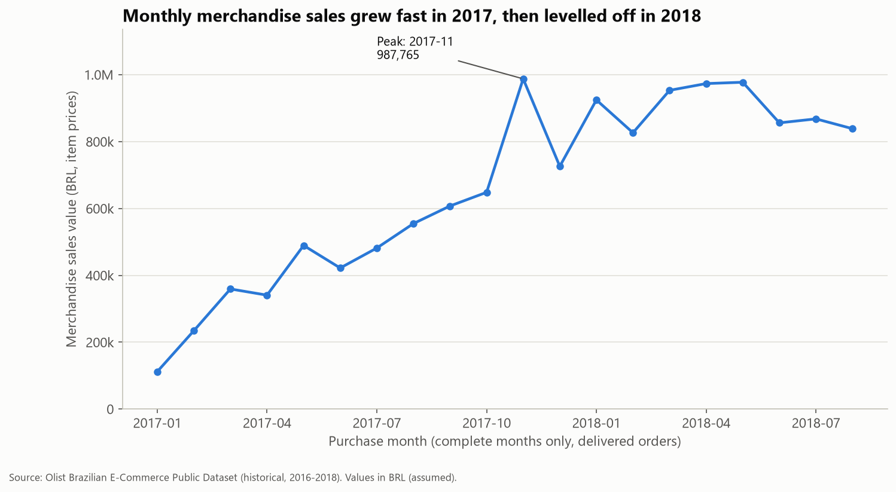
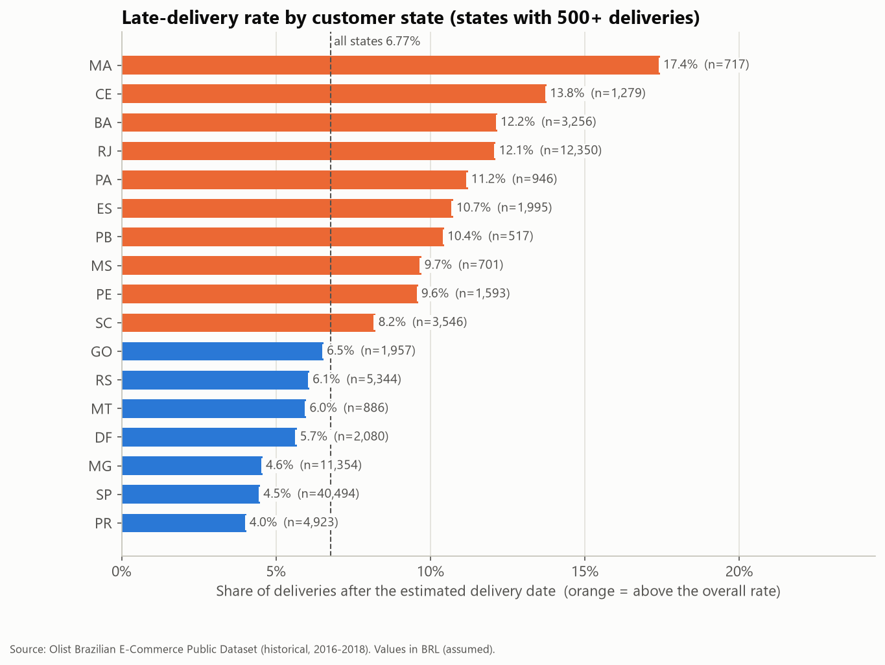
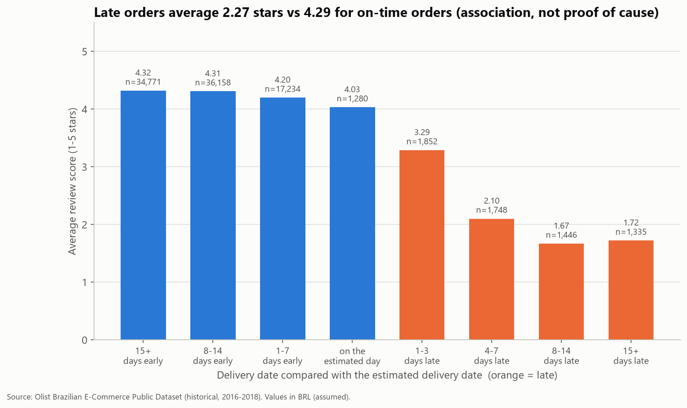

# E-commerce Sales and Delivery Analysis (Olist)

An end-to-end SQL and Python analysis of about 99,000 historical orders from a Brazilian e-commerce marketplace: data cleaning, reporting models with validation checks, business metrics, charts and written findings. The whole project rebuilds from the raw CSV files with one command.

## Business problem

An e-commerce operations manager wants to understand:

1. How sales and order volume change over time.
2. Which product categories and customer regions contribute most sales.
3. How average order value varies.
4. How often customers purchase again.
5. Where delivery delays are concentrated.
6. How delivery timing is associated with customer review scores.

## Dataset

**Brazilian E-Commerce Public Dataset by Olist** ([Kaggle](https://www.kaggle.com/datasets/olistbr/brazilian-ecommerce), licence CC BY-NC-SA 4.0). Eight of the nine files are used: orders, order items, payments, reviews, customers, products, sellers and the category translation.

- Coverage: orders placed from 2016-09-04 to 2018-10-17. Complete months for trend analysis: 2017-01 to 2018-08.
- Size: 99,441 orders, 112,650 order items, 103,886 payment records, 99,224 reviews, 96,096 unique customers.
- The data is historical and anonymised. Results describe that period only, not Olist today. Money values are assumed to be Brazilian reais (BRL).
- Raw files are not included in this repository. See [data/README.md](data/README.md) for download steps.

## Headline findings

1. **Sales more than doubled year on year, then levelled off.** January–August merchandise sales rose from 2.99M in 2017 to 7.22M in 2018 (+141.1%), but monthly sales in 2018 stayed between 0.83M and 0.98M. Average order value stayed between 124 and 149, so growth came from order volume.
2. **Late deliveries are concentrated.** 6.77% of orders arrived after the estimated date overall, but the rate ranges from 4.04% (PR) to 17.43% (MA) among states with 500+ deliveries. RJ has 12.8% of deliveries but 22.9% of late ones.
3. **Late orders get much lower reviews.** On-time orders average 4.29 stars and late orders 2.27 (89,443 vs 6,381 reviewed orders). The gap appears within every state checked. This is an association, not proof of cause.

Full results, recommendations and limitations: **[reports/findings.md](reports/findings.md)**







More charts: [orders and AOV](reports/figures/02_monthly_orders_and_aov.png), [top categories](reports/figures/03_top_categories.png), [sales by state](reports/figures/04_sales_by_state.png).

## Tools and skills demonstrated

- **SQL (SQLite):** cleaning with documented rules, CTEs, window functions (`ROW_NUMBER`, `LAG`, `SUM() OVER ()` for shares of total), aggregation to the right grain before joining, medians without a built-in function.
- **Data validation:** 41 automated checks on key uniqueness, required fields, referential integrity, row counts and money totals before and after joins, and timestamp order. The pipeline stops if any check fails.
- **Python:** pandas and pathlib for loading CSVs and running the SQL workflow; matplotlib for charts.
- **Analysis and communication:** clear metric definitions, sample sizes and minimum-volume thresholds, careful wording of associations, and written recommendations tied to evidence.

## How the project is built

```
raw CSVs ──> raw_* tables ──> clean_* tables ──> model_* tables ──> analysis tables ──> charts
          load_raw.py     sql/cleaning/     sql/models/       sql/analysis/      make_charts.py
                                                 │
                                          sql/validation/ (stops the run if a check fails)
```

| Folder / file | Contents |
|---|---|
| [`run_project.py`](run_project.py) | Runs every step in order (load, profile, clean, model, validate, analyse, chart) |
| [`sql/inspection/`](sql/inspection/) | Raw data profiling and cleaning summary |
| [`sql/cleaning/`](sql/cleaning/) | Cleaning rules: date parsing, status groups, flags, category translation |
| [`sql/models/`](sql/models/) | Reporting models: order-level, item-level, customer, monthly sales, delivery performance |
| [`sql/validation/`](sql/validation/) | Validation checks run on every rebuild |
| [`sql/analysis/`](sql/analysis/) | 26 commented analysis queries in 7 files |
| [`src/`](src/) | Python loader, SQL helpers and chart script |
| [`reports/`](reports/) | [Findings](reports/findings.md), [data quality report](reports/data_quality.md), [figures](reports/figures/), [result tables](reports/tables/) |
| [`docs/`](docs/) | [Data dictionary](docs/data_dictionary.md), [metric definitions](docs/metric_definitions.md) |

Key decisions (details in the linked documents):

- **No rows are deleted in cleaning.** Unusual records are flagged (for example 166 orders with a carrier date before the purchase) and each metric states what it includes.
- **Sales use delivered orders**; delivery metrics use orders with a valid delivery date.
- **Items, payments and reviews are aggregated to one row per order before joining.** Joining them directly would inflate payment totals by 26.9%.
- **Late = delivery date after the estimated date**, compared as dates because the estimate has no time part.
- **Merchandise value (item prices), freight and payment value are kept separate.** Merchandise value is not company revenue.

## How to reproduce

Requirements: Python 3 with pandas and matplotlib (`requirements.txt`). SQLite is built into Python.

1. Download the dataset from Kaggle and extract the CSV files into `data/raw/` ([steps](data/README.md)).
2. Install the requirements:

```bash
pip install -r requirements.txt
```

3. Run the whole pipeline from the project folder:

```bash
python run_project.py
```

This rebuilds the SQLite database (`data/processed/olist.db`), all tables in `reports/tables/` and all charts in `reports/figures/`. It is safe to rerun, and it stops with a clear message if a validation check fails.

## Limitations

- Historical data only (2016–2018); boundary months are incomplete and excluded from growth.
- 610 products have no category (1.29% of delivered sales); carrier dates are unreliable for at least 189 orders and are not used.
- Observational data: comparisons show associations, not causes.
- Repeat purchasing is measured within the data period only; customers who first bought late had little time to return.
- Currency is not stated in the files and is assumed to be BRL.

## Contribution note

Project designed, reviewed and documented by Anas Mehmood as a learning portfolio project. It uses a public dataset and has no connection with Olist.
