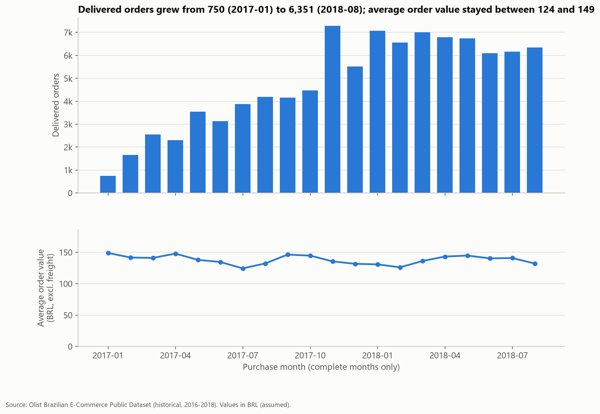
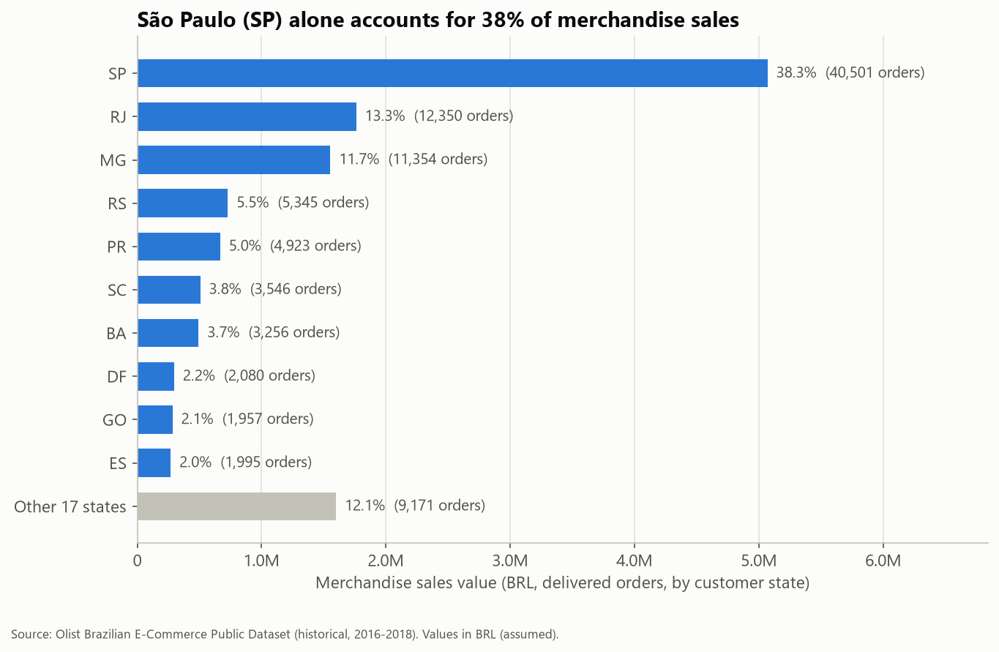
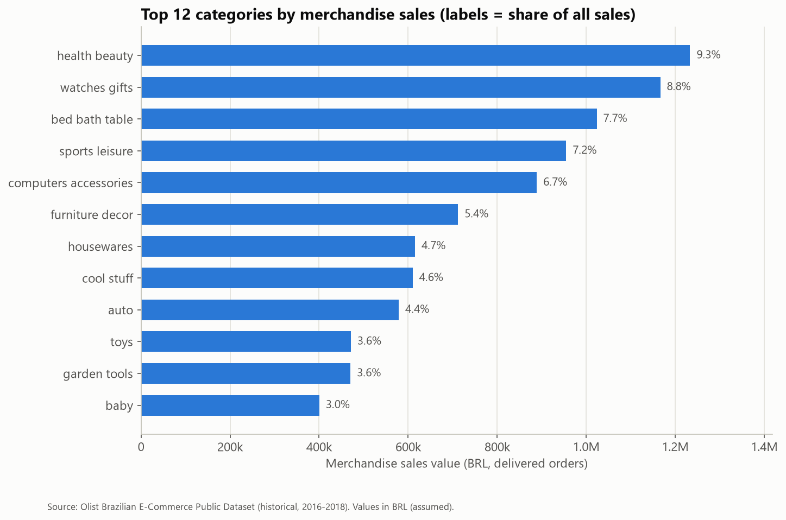

# Findings

This report answers the business questions in the [README](../README.md) using the historical Olist dataset (orders placed from 2016-09 to 2018-10). Every number comes from the SQL in [`sql/analysis/`](../sql/analysis/); the result tables are in [`reports/tables/analysis/`](tables/analysis/) and the metric rules in [`docs/metric_definitions.md`](../docs/metric_definitions.md).

The results describe that period only, not Olist today. Money values are assumed to be BRL. All comparisons are **associations**: the data is observational, so it can show where problems are concentrated but not prove what causes them.

## Summary

| Measure | Value |
|---|---|
| Delivered orders | 96,478 (from 93,358 people) |
| Merchandise sales value (item prices) | 13,221,498.11 |
| Freight (reported separately) | 2,198,275.64 (16.63% of merchandise value) |
| Average order value | mean 137.04, median 86.57 |
| Late-delivery rate | 6.77% (6,534 of 96,470 valid deliveries) |
| Average review score, on time vs late | 4.29 vs 2.27 |
| Repeat-customer rate | 3.00% (2.11% excluding second orders on the same day) |

## 1. Sales grew strongly through 2017 and then levelled off in 2018, driven by order volume rather than order value

- Comparing the same eight months, merchandise sales rose from 2,993,456.13 (January–August 2017) to 7,218,125.12 (January–August 2018), **+141.1%**. Delivered orders rose by a similar +139.9% (21,998 to 52,783).
- Most of that growth happened during 2017. In 2018 monthly sales stayed between 826,437.13 and 977,544.69, and August 2018 (838,576.64) was below January 2018 (924,645.00).
- The single highest month was **November 2017**: 987,765.37 in sales and 7,289 delivered orders, +52.4% in sales on October. December then fell 26.5%.
- Average order value stayed between 124 and 149 in every complete month, so the growth came from **more orders, not larger orders**.

**Business meaning:** the marketplace scaled quickly in 2017, but by 2018 volume was flat. Further growth would need more customers or more orders per customer, since basket size did not move. The November spike is a planning signal for peak periods (see finding 3).

## 2. Sales are concentrated in a few states and categories

- **São Paulo (SP) accounts for 38.33% of merchandise sales**; SP, RJ and MG together account for 63.38%.
- Customers further from SP pay more freight relative to what they buy: freight is 13.9% of merchandise value in SP, 19.8% in BA and 22.7% in PE. Their average order value is also higher (SP 125.12, BA 151.59, PE 158.12).
- Across 74 categories (including `unknown`), the top 5 make up 39.83% of sales and the top 10 make up 62.43%. The largest are health_beauty (9.33%), watches_gifts (8.82%) and bed_bath_table (7.74%). Products with no category are 1.29% of sales.

**Business meaning:** performance in a few southeastern states and about ten categories drives most results. Changes there (delivery problems, stock issues) have the largest effect on the total. The higher freight share outside the southeast may discourage smaller orders there; this is a hypothesis, not something the data proves.

## 3. Late deliveries are concentrated by state and route, and in specific months

- Overall, 6.77% of valid deliveries arrived after the estimated date (median delivery time 10.22 days from purchase).
- Among the 17 states with at least 500 deliveries, the late rate ranges from **4.04% (PR) to 17.43% (MA)**. Northeastern states such as MA, CE (13.76%) and BA (12.16%) are highest.
- **Rio de Janeiro (RJ) stands out by volume**: it has 12.8% of deliveries but 22.9% of all late deliveries (1,495 of 6,534), with a 12.11% late rate compared with 4.49% in SP.
- **Route matters**: for single-seller orders, when the seller is in a different state from the customer the late rate is 8.14% and average delivery takes 15.21 days, compared with 4.56% and 7.97 days when both are in the same state (60,961 and 34,234 orders).
- **Some months were much worse**: 12.40% of orders placed in November 2017 were late, and 14.13% and 18.96% in February and March 2018, compared with between 2.79% and 6.56% in each month from January to October 2017.

**Business meaning:** delivery problems are not spread evenly. A small number of states (especially RJ by volume and the Northeast by rate), cross-state routes and specific periods account for a large share of late orders. The November 2017 rise coincided with the volume peak; February–March 2018 did not have a matching volume jump, so the cause there is unknown from this data.

## 4. Late orders receive much lower review scores

- On-time orders average **4.29** stars (89,443 reviewed orders); late orders average **2.27** (6,381 reviewed orders).
- 62.42% of reviews for late orders are 1 or 2 stars, compared with 9.27% for on-time orders.
- The drop is steep: orders delivered on the estimated day average 4.03, 1–3 days late 3.29, and 4–7 days late 2.10.
- The gap is present **within every one** of the 14 states with at least 100 reviewed late orders (late vs on time: SP 2.547 vs 4.325, RJ 1.914 vs 4.243), so it is not only a difference between regions.

**Business meaning:** delivery timing is strongly associated with customer satisfaction. It is not proof that lateness causes low scores; late orders may also differ in product, seller or other service problems. But the size and consistency of the gap make delivery reliability one of the clearest levers to test.

## 5. Very few customers bought again within the observed period

- Of 93,358 people with a delivered order, **2,801 (3.00%) placed two or more** delivered orders. 829 of them placed the second order on the same day as the first; excluding these, 2.11% came back on a later day.
- 97.0% of people have exactly one delivered order.
- Using a fairer fixed window, **1.92%** of the 55,907 people who could be followed for at least 180 days placed another order within 180 days.
- The observed rate depends heavily on follow-up time: 3.88% for people who first bought in 2017-Q2 (about 467 days of follow-up) against 0.60% for 2018-Q3 (about 30 days).
- Repeat customers had a slightly lower average first order (123.17) than one-time customers (137.96).

**Business meaning:** within this data, growth depended almost entirely on new customers. This is repeat purchasing within the data period, not lifetime retention, and customers may have bought from the same sellers through other channels that are not recorded.

## Recommendations

1. **Make delivery estimates and routes more reliable where lateness is concentrated.** Start with RJ (22.9% of late deliveries) and the northeastern states with late rates above 12%, and with cross-state routes (8.14% late vs 4.56%). Options to test: more realistic estimated dates for these routes, or sellers/stock closer to these customers. Evidence: findings 3 and 4 — even 1–3 days late is associated with a drop from 4.03 to 3.29 stars. Success measure: late rate by state and route, tracked monthly.
2. **Plan capacity and monitoring for peaks.** The November 2017 volume peak coincided with a late rate of 12.40%, and February–March 2018 reached 14–19%. A monthly late-rate alert and extra logistics capacity before known peaks would catch these earlier. Evidence: finding 3 and `late_by_month`.
3. **Test a repeat-purchase programme and measure it with a fixed window.** Only 1.92% of customers came back within 180 days. A controlled test (for example a follow-up offer after an on-time delivery, compared against a group that does not receive it) would show whether repeat buying can be increased. Track the 180-day repeat rate rather than the raw repeat rate, which depends on follow-up time. Evidence: finding 5.

## Further analysis needed

- **Seller-level delivery performance**: whether late deliveries come from a small group of sellers.
- **Distance and freight**: the geolocation file (not used here) could measure seller-to-customer distance and test how much of the state differences it explains.
- **What happened in February–March 2018**: carrier data or operational records would be needed to explain the late-rate spike.
- **Review text**: comments (in Portuguese) could show whether low scores mention delivery or product problems.
- **Causal testing**: only a controlled experiment could show whether improving delivery times raises review scores or repeat purchases.

## Limitations

- **Historical coverage.** The data covers orders from 2016-09 to 2018-10; complete months are 2017-01 to 2018-08. Results do not describe Olist today.
- **Missing and inconsistent data.** 610 products have no category (1.29% of delivered sales). 8 delivered orders have no delivery date and are left out of delivery metrics. Carrier dates are unreliable for at least 189 orders, so they are not used. See the [data quality report](data_quality.md).
- **Observational analysis.** All comparisons are associations. Late orders, states and categories differ in many ways the data does not capture.
- **Customer follow-up time.** People who first bought late in the period had little time to buy again, so the overall repeat rate understates longer-term repeat behaviour. Repeat customers are identified by `customer_unique_id`, which is the best identifier available.
- **Recent months.** Orders not delivered by the time the data was extracted are excluded from delivered metrics, which can make the last months look slightly smaller and faster.
- **Merchandise value is not revenue.** It is the value of goods sold through the marketplace; Olist's own revenue (commissions and fees) is not in the data.
